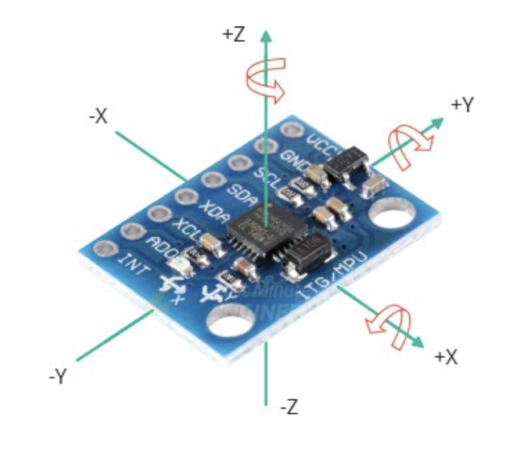

## MPU-6050 chip
The MPU-6050 chip measures three functions; acceleration, rotation and temperature.

Rotational axis of MPU-6050 is shown below: 

### Acceleration accelerometer
The accelerator on the MPU-6050 chip is MEMS (Micro Electro Mechanical Systems) accelerometer which measures *linear* acceleration.

Note: acceleration is measured as a force. MPU-6050 yields a CONSTANT accleration for the z-axis of ~9.8 m/s^2 when the board is flat. This is expected and is due to the force of gravity.

### Rotation gyroscope
A MEMS gyroscope is used to measure angular rotation by employing The Coriolis Effect. 

Units of measure for gyroscope is a **velocity** measured in radians per second (rad/s). 

## Ideas to investigate
Understand what the raw measurements are being produced by the MPU-6050 chip.

## Code investigate

[Implementation of quaternion maths for Arduino](
https://github-com.translate.goog/jrowberg/i2cdevlib/tree/master/Arduino/MPU6050?_x_tr_sl=auto&_x_tr_tl=en&_x_tr_hl=en-GB)

[Base implementation of 'working' MPU-6050 library albeit with undefined units](https://github.com/jarzebski/Arduino-MPU6050/blob/master/README.md)