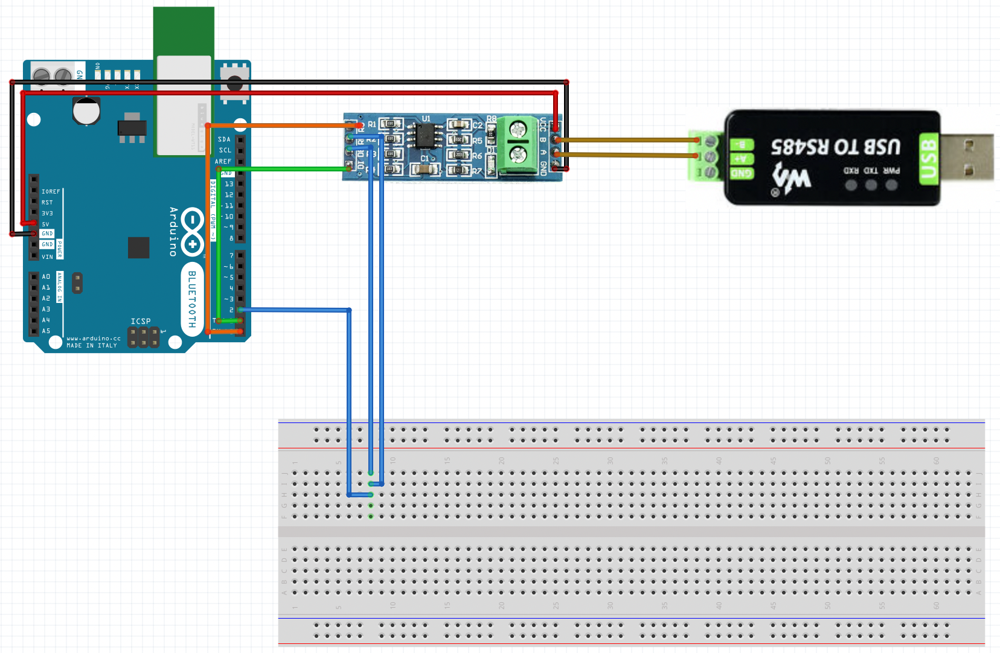
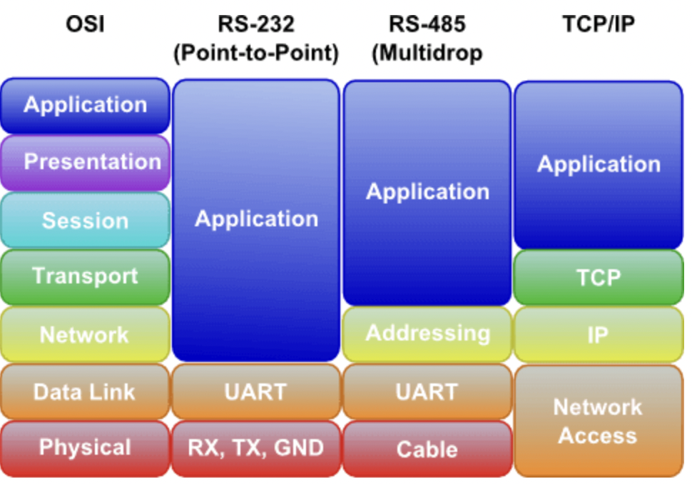
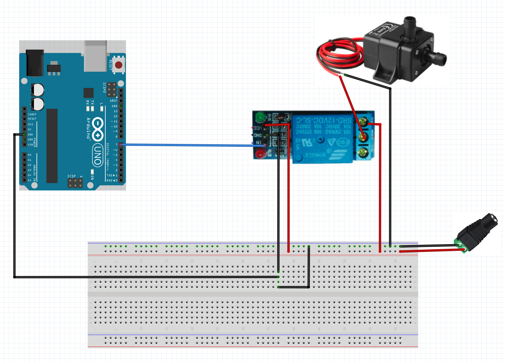

# ModBus Project

## Minimum working Modbus example:
A minimum working example of communicating via ModBus between master (PC/MAC) and slave (Arduino) with the following architecture: 

The minimum working ModBus example uses following: 
- Hardware: 
    1. Arduino Uno
    2. MAX485 chip
    3. USB-to-RS-485
- Software:
    1. Slave (Arduino): [ModBus RTU](https://github.com/smarmengol/Modbus-Master-Slave-for-Arduino)
        - Example code: modbus_hello_world_slave_arduino.ino
    2. Master (PC/MAC): [MinimalModBus](https://github.com/pyhys/minimalmodbus)
        - Example code: modbus_hello_world_master_mac.py


## Code: 
- *receive_serial_hello_world.ino* : code for minimum example of Arduino reading serial using MAXX-485 chips (hello_world_trans_receive_serial.png).
- *transmit_serial_hello_world.ino* : code for minimum example of Arduino transmitting serial using MAXX-485 chips(hello_world_trans_receive_serial.png).

- Bash command to get serial devices: 
```{bash}
ls /dev | grep usbserial
```

## ModBus Overview 
https://www.youtube.com/watch?v=xjgznfsHpzk

There are 3 types of ModBus variations, each variation are incompatible: 
1. ASCII (serial)
2. RTU (serial)
3. TCP/IP (serial)

### Serial vs TCP/IP
Serial uses master/slave whereas TCP/IP uses client server. 
Serial connections must be connected in daisy chain pattern. 

Big difference betweent serial and TCP/IP
Serial has message of form: 
    1. Slave id
    2. Function code
    3. Data
    4. CRC

TCP has message of form: 
    1. MBAP (ModBus Application Header) header -> contains info to route message to device
    2. Function code
    3. Data

SERIAL (RTU)
Typically uses one of 3 *electrical interfaces* RS232, RS422 or RS485, however, 

The Baud rate (measure in bits per second) is the speed at which messages are sent; all devices on an RTU network with typical speeds between 9600-19200 however network is capable of communicating between 300 - 100000+

TCP/IP 
Client connects to switch which is connected to all the servers on network. 
Requires IP address and sub-net mask. 

### Adressing system
Discrete values = coils
16 bit values = registers

Coil - read/write --> 00001 - 09999
Discrete inputs - read only --> 10001 - 19999
Input registers - read only --> 30001 - 39999
Holding registers - read/write  --> 40001 - 49999

## ModBus PC simulator 
https://libmodbus.org/ will be used as the software for computer interface to ModBus system (acting as DCS). Can be run on Raspberry Pi and Mac.

## Questions to answer;
How to the following set point flow working: 
    1. [ ] Python or C program on laptop
        - Could help background for writing to serial port https://stackoverflow.com/questions/4715340/python-twisted-receive-command-from-tcp-write-to-serial-device-return-response
    2. [ ] Write from Python or C program to WaveShare USB to RS485
    3. [ ] Send set point to to MAXX485 
    4. [x] MAXX485 conver RS485 back to TTL and send to Arduino 
    5. [x] Arduino consumes set point

What is ModBus RTU (remote terminal unit)? 
ModBus is not part of the physical layer (application layer only), and therefore can be utilized across many different types of networks. As ModBus is application level only it's termed application level SCADA protocol. 

There are *two variants of ModBus protocol;* **ModBus RTU** and **ModBus ASCII**; the former is compact, uses binary communication and and uses cyclic redundancy check checksum. **ModBus ASCII** on the other hand uses characters that can be read by humans (not binary) and uses the less secure longitudinal redundancy check checksum. ModBus RTU should always be used over ModBus ASCII where possible. 

What is serial communication? 
In data communication, serial is the process of sending data one bit at a time, sequentially, over a communication channel or computer bus. There are numerous architectures which implement serial communication including Ethernet,FireWire, RS232 and RS-485.

What actually is RS-485 (is it hardware, communication protocol, etc.)? 
The ModBus protocol/architecture is best understood with the following diagram:


What is the difference between ModBus and RS-485? 
ModBus software protocol whereas RS-485 is hardware protocol. 


What is the difference between TTL and RS485?
*Electrical characteristics of the interface*
- *RS-485* also has a differential negative logic relationship; logic "1" is voltage between -2V to -6V, logic "0" is 2V to 6V.
- *TTL* has positive logic relation; logic "1" is +5V, logic "0" is 0V. 

*TTL* uses a 'single ended' (only one cable) where pulses of electricity are sent encoding a digital true false. Where as ModBus uses the differential between channels A and B to encode information, differential signalling. An RS-485 networking signal can be used for distances of hundreds of meters, while a TTL signal is usually good for a few centimeters.

What is the OSI model? 


## Notes: 
Setup for Arduino water pump can be found here: 


Looking for appropriate software to enable laptop to output RS485. 

*Minimal Modbus*
Minimal Modbus is a lightweight solution for communication with instruments use ModBus RTU. It's an easy-to-use Python module for talking to instruments (slaves) from a computer (master) using the Modbus protocol, and is intended to be running on the master. The only dependence is the pySerial module (also pure Python). 
*Minimal ModBus* recommends more robust and feature reach [programs](https://minimalmodbus.readthedocs.io/en/stable/related.html) for advanced use case.


*PyUSB*
PyUSB provides an interface to access USB port on computer; PyUSB has depedencies on libusb which doesn't come installed. Installing  libusb for MAC currentl fails for `brew` via `brew install libusb`. Instead install from tar ball by downloading [here](https://libusb.info/) and there following general MAC install instructions: 
```{bash}
tar xvjf libusb.tar.bz2
Navigate to the extracted folder using cd command
cd libusb
Now run the following command to install the tarball
./configure
make
sudo make install
```

## ModBus terminology

- Channel/device ID: integer between 0-247 identifying device on ModBus network. 
- Register: 
- Coil:


### Waveshare USB to ModBus (WSUM) module
This is an industrial USB to RS485 converter with original FT232RL inside. Few tutorials are available online for the WSUM, however, there seems to be relatively more documentation on FT232R chip the WSUM uses.

Follow up on this tutorial:
https://medium.com/@peterfitch/modbus-and-rs485-a-python-test-rig-1b5014f709ec

### Setup
The Waveshare USB to ModBus module is a two pin RS485 module. Note: the 3rd pin is a ground pin is not needed for communication. Further channel A will link to channel A and channel B to channel B.

### Installation
For MAC:
1. Download drivers from [FTDI website](https://ftdichip.com/drivers/vcp-drivers/)
2. Extract zip into 'Applications' folder
3. Double click file to and accepted "Grant Permissions" 
4. Plug in WaveShare USB USB to RS485, navigate to Applications -> Utilities -> System Information -> 'USB' left hand panel
5. 'FT232R USB UART' will be listed if drivers are correctly installed. 

### Experiments:
Accessing WSUM from a software program such as *Minimal ModBus* or *PyModBus*. 
- How will Python program know the location of the WSUM? Is there a 'hello world' test to show a connection has been made? 
    - Starting by finding the port number given WSUM has been setup correctly. MAC commands for this `ls /dev/tty*`
    - Then use *pymodbus* to see if I can successfully connect to device. \[Success; well atleast when I ran the code with WSUM plugged in no error was thrown, when WSUM was removed error was thrown!!!\]
    - Most likely need to understand modbus coils
        - --> **coils** seem to have relation to **register**.
    - If no error messages, then will try and write from Adruino to WSUM.

- Can commands simply be sent to to WSUM over serial and WSUM converts to RS485?
    - Tried this using the *minimal_modbus_example.py* where Arduino/MAX485 chip is sending serial to the WSUM. NOTE: checked TTL to RS-485 and conversion back using the '../images/hello_world_trans_receive_serial.png' architecture. Response was as expected. 
        - ** NEXT STEPS**: 
            - Attempt to write to register and have Arduino/MAX485 read the response instead? 
        - **RESULTS**:
            - Executing the *minimal_modbus_example.py* lights up the 'RXD light on WUSM' ONLY when Arduino is powered on. RXD light flashes on/off for ~10 seconds and then stops. 
            - When Arduino has no power i.e. not writing serial error *minimalmodbus.NoResponseError: No communication with the instrument (no answer)* is thrown WHERE AS ARDUINO I.E. SERIAL WRITE ON throws error *minimalmodbus.InvalidResponseError: Checksum error in rtu mode: '\x8bÑ' instead of 'hÍ' . The response is: '\x85±ue\x90\x97W\x8bÑ' (plain response: '\x85±ue\x90\x97W\x8bÑ')*.

        - **CONCLUSIONS**:
            - WSUM is conneted and able to interface with through Python on correct ports (may need to try using different verisions of WSUM). Arduino/MAX485 is causing impact on WSUM however passing through incorrect data.
    - DOUBLE CHECK HELLOW WORLD ARCHITECTURE

Instead of trying direct access to WSUM via ModBus master program can a *test* approach achieve succesful connetion with the WSUM? 


## Arduino basics

### Communication protocols
Serial Communication is a way for data transfer, transmitting over one wire, one bit, at a time. Pins 0 and 1 on the Arduino are dedicated to serial receiver input and transmission output, respectively. Arduino use the Transistor-Transistor Logic (TTL) protocol for receiver/transmission. TTL signals operate between 0volts - 3.3volts making it perfect for the Arduino. 

To interface microcontrollers with RS-485 (ModBus protocol) the project uses MAX485 (TTL to RS-485) modules.


## Transmit-Receiver test
**Goal: test Arduino capability to communicate with RS-485 signal via RS-485 to TTL conversion. Necessary, for  Arduino to act as microcontroller for ModBus project.*
Files transmitter_modbus_experiment.ino & receiver_modbus_experiment.ino are a test in Arduino-Arduino communication over RS-485. Given two Arduinos, upload transmitter_modbus_experiment.ino to transmission Arduino and receiver_modbus_experiment.ino to the other. A serial monitor can be opened on receiver Arduino to view incoming communication from transmitter Arduino.
