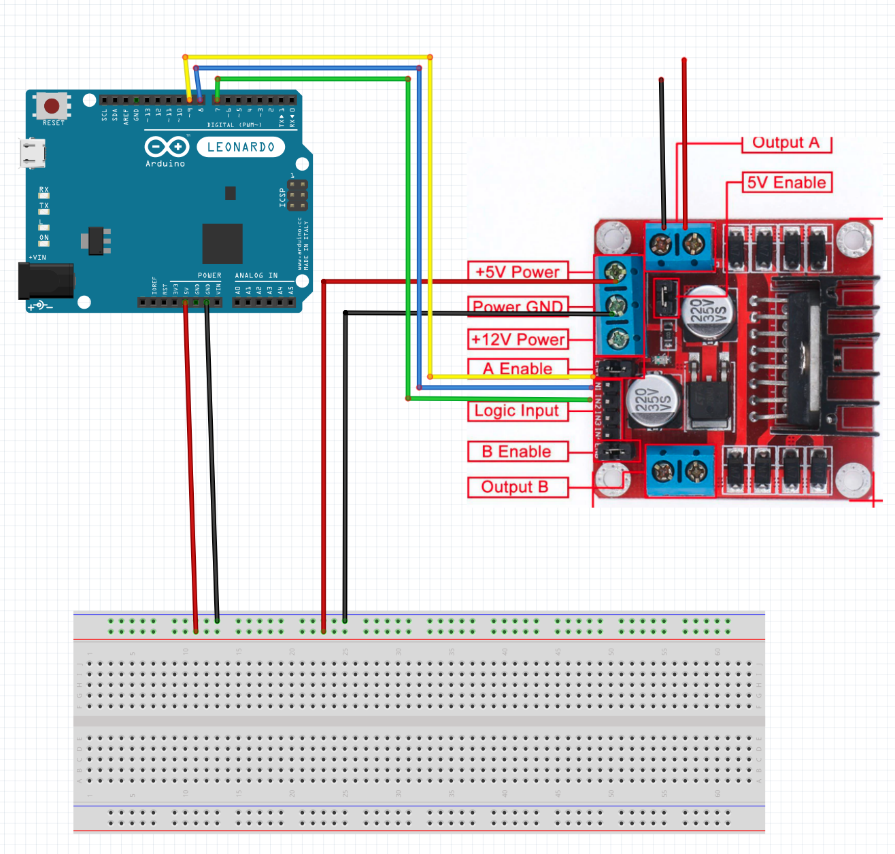

## L298 board
A H-bridge can be used to control DC motor. 

Input can be between 5v - 35v.
Has 5v jumper fuse which may need to be removed if supply voltage is greater than 5v DC. When open we're using the optional 5v power supply.

An Arduino can be powered from the L298 power supply terminals. If Arduino is not powered from L298 ensure that L298 and Arduino share a ground connection. 

Speed of motors can be controled by PWM. 
PWM - send pulses to motor. Increase pulse width will increase speed of motor.
Apply 5v or ground to INx will move motors forward or backward.

Pins:
    Motor A: 
        - ENA
        - IN1
        - IN2
    Motor B:
        - ENB
        - IN3
        - IN4
        
## Arduino - hello world motor drive
Basic example of driving DC motor via Arduino control and power supply.

### What is a DC motor
Obviously, motor that operates on DC current. 

Comprised of:
    - Armature
    - Commutator - DC current is applied to commutator
    - Brushes 
    - Permanent magnets

## H-bridge
Has 4 switches with a motor sitting in middle of bridge with postive currenton one side and negative on the other. 
