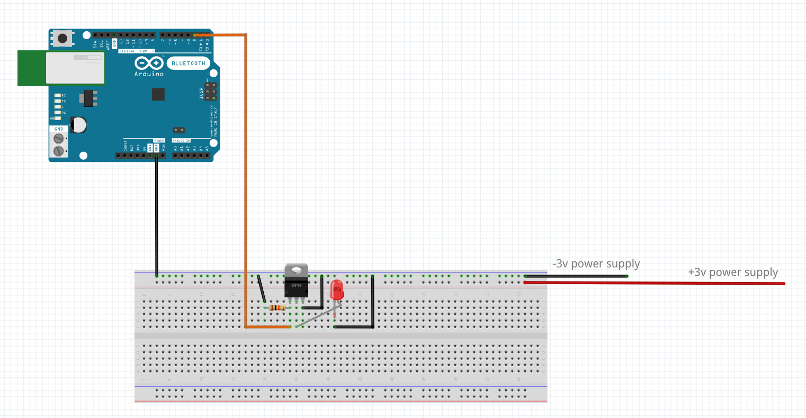

## Basics
A folder to capture learnings along the way as knowledge increases in the electrical engineering & controls space. 

### Transistors
Transistors are a component useful for controlling equipment in a circuit. 

#### N-channel MOSFET
Although there are two types of MOSFETS, N and P channel, N channel MOSFETs are prodominately used. 
Through out the repo the [30N06NL MOSFET](https://www.googleadservices.com/pagead/aclk?sa=L&ai=DChcSEwjCxZClv4n3AhUBCSsKHee8Cj4YABADGgJzZg&ae=2&ohost=www.google.com&cid=CAESauD2s9Y0o4BKrifYHagBiiln3d17sHXyVkI5UH0b6w2tt6dNfT4sM4rLYnSJVgijIHds6kxqDXc9qix-YJur8EtSNk-qbcSFrCfKFWXdGvBtpNlICt5AfwJhk3EroqDXQZK8pB3SvEUzLTs&sig=AOD64_3-JqV5jU0p9EihYvUCjR-UB5GI1w&q&adurl&ved=2ahUKEwjn6Ymlv4n3AhWXRWwGHWUeCvgQ0Qx6BAgCEAE) is used.

As a simple test case/hello world MOSFET tutorial for controlling an LED using a MOSFET is detailed below. First set up the hardware shown in diagram below:
 

Then upload code found in 
